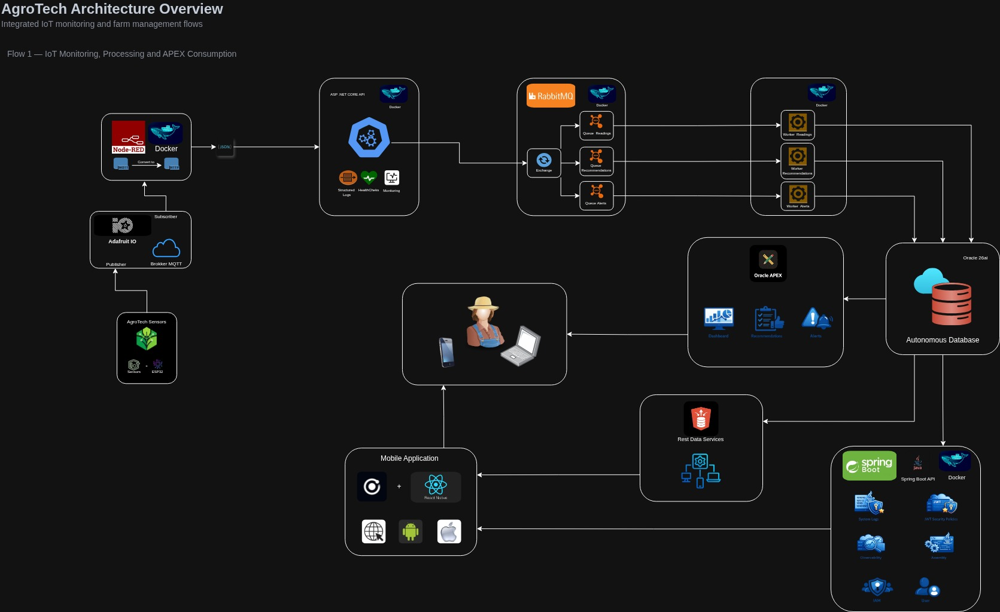

# AgroTech IoT API

API e ecossistema de apoio para agricultura inteligente, desenvolvidos em **ASP.NET Core (.NET 8)** com **Clean Architecture**, integrando **Adafruit IO**, **Node-RED**, **Oracle**, **RabbitMQ** e **workers assíncronos** para alertas e recomendações.

---

## Sumário

- [Visão geral](#visão-geral)
- [Objetivo do projeto](#objetivo-do-projeto)
- [Escopo atual](#escopo-atual)
- [Arquitetura atual](#arquitetura-atual)
- [Fluxos do sistema](#fluxos-do-sistema)
- [Sensores e tipos utilizados](#sensores-e-tipos-utilizados)
- [Estrutura do projeto](#estrutura-do-projeto)
- [Componentes da solução](#componentes-da-solução)
- [Tecnologias utilizadas](#tecnologias-utilizadas)
- [Endpoints da API](#endpoints-da-api)
- [Health checks](#health-checks)
- [HATEOAS](#hateoas)
- [Logging estruturado](#logging-estruturado)
- [Observabilidade com OpenTelemetry](#observabilidade-com-opentelemetry)
- [RabbitMQ](#rabbitmq)
- [Workers](#workers)
- [Node-RED](#node-red)
- [Simulador Python + Adafruit IO](#simulador-python--adafruit-io)
- [Credenciais e configurações necessárias](#credenciais-e-configurações-necessárias)
- [Como executar o projeto](#como-executar-o-projeto)
- [Scripts de automação](#scripts-de-automação)
- [Migrations](#migrations)
- [Testes automatizados](#testes-automatizados)
- [Exemplos de requisição](#exemplos-de-requisição)
- [Status atual do projeto](#status-atual-do-projeto)

---

## Visão geral

O **AgroTech IoT API** é o backend do ecossistema AgroTech, responsável por receber leituras de sensores agrícolas/ambientais, validá-las, persistí-las no Oracle e disponibilizá-las por API REST.

Além da ingestão síncrona, o projeto evoluiu para um fluxo assíncrono com **RabbitMQ** e três workers:

- **AgroTech.Worker.Alerts**
- **AgroTech.Worker.Recommendations**
- **AgroTech.Worker.Readings**

Também fazem parte do ambiente de desenvolvimento:

- **Node-RED em Docker**, responsável por consumir dados MQTT do Adafruit IO e enviar leituras para a API;
- **simulador Python em Docker**, responsável por gerar dados agrícolas realistas e publicar no Adafruit IO.

> Importante: o sistema representa **leituras de telemetria**, não cadastro fixo de dispositivos. Cada registro salvo no banco representa uma nova leitura recebida em um determinado momento.

`Abaixo, um diagrama para ilustrar o fluxo:`




---

## Objetivo do projeto

O projeto foi construído para:

- receber dados de sensores IoT enviados via HTTP pelo Node-RED;
- validar e processar essas leituras;
- armazenar os dados em banco Oracle;
- disponibilizar consultas com filtros, ordenação e paginação;
- publicar eventos de novas leituras no RabbitMQ;
- processar alertas e recomendações de forma assíncrona;
- preparar a base para consumo futuro por dashboards e Oracle APEX;
- oferecer observabilidade, health checks, logs estruturados e testes automatizados.

---

## Escopo atual

O escopo atual contempla:

- API REST para CRUD de leituras de sensores;
- endpoint de busca com paginação, filtros e ordenação;
- health checks da aplicação;
- logging estruturado com Serilog;
- tracing e métricas com OpenTelemetry;
- testes unitários e de integração;
- RabbitMQ com exchange e filas de processamento assíncrono;
- worker de alertas;
- worker de recomendações;
- simulador Python em Docker;
- Node-RED em Docker;
- documentação operacional do ambiente local.

---

## Arquitetura atual

Fluxo ponta a ponta do ambiente atual:

```text
Simulador Python -> Adafruit IO -> Node-RED -> API .NET -> Oracle -> RabbitMQ -> Workers
```

### Visão em camadas

- **Domínio**: entidades e contratos centrais do negócio
- **Aplicação**: regras de negócio, DTOs e serviços
- **Infraestrutura**: acesso a dados, EF Core, Oracle e repositórios
- **Web**: controllers REST, middleware, Swagger, views e recursos HTTP
- **Mensageria**: publisher RabbitMQ na API
- **Workers**: consumidores de alertas e recomendações

---

## Fluxos do sistema

### Fluxo principal de ingestão

```text
Simulador / Sensores -> Adafruit IO -> Node-RED -> POST /api/sensors -> Oracle
```

### Fluxo assíncrono de eventos

```text
API .NET -> RabbitMQ (agrotech.events) -> agrotech.alerts.queue -> Worker Alerts
                                       -> agrotech.recommendations.queue -> Worker Recommendations
```

### Situação atual dos workers

Neste momento, os workers:

- consomem mensagens do RabbitMQ;
- aplicam regras de alerta e recomendação;
- registram o resultado em log.
- persistem alertas, recomendações e leituras no Oracle 

---

## Sensores e tipos utilizados

Os sensores atualmente padronizados no fluxo são:

| Tipo | Nome |
|---|---|
| 11 | Temperatura do Ar |
| 12 | Umidade do Ar |
| 13 | Umidade do Solo |
| 14 | pH do Solo |
| 15 | Luminosidade |
| 16 | Velocidade do Vento |
| 17 | Chuva |
| 18 | Temperatura do Solo |

---

## Estrutura do projeto

Estrutura lógica atual:

```text
AgroTech/
├── start-dev.sh
├── stop-dev.sh
├── start-dev.ps1
├── stop-dev.ps1
├── logs/
├── .run/
└── AgroTech/
    ├── compose.yaml
    ├── AgroTech/
    │   ├── Program.cs
    │   ├── Program.Public.cs
    │   ├── appsettings.json
    │   ├── appsettings.Development.json
    │   ├── Migrations/
    │   └── src/
    │       ├── Application/
    │       ├── Domain/
    │       ├── Infrastructure/
    │       └── Web/
    ├── AgroTech.Contracts/
    ├── AgroTech.Worker.Alerts/
    ├── AgroTech.Worker.Recommendations/
    ├── AgroTech.Worker.Readings/
    ├── AgroTech.UnitTests/
    ├── AgroTech.IntegrationTests/
    └── infra/
        ├── sensor-simulator/
        │   ├── Dockerfile
        │   ├── requirements.txt
        │   ├── simulador_sensores_agrotech.py
        │   ├── .env.sensor-simulator.example
        │   └── .env.sensor-simulator
        └── node-red/
            └── data/
```

> Observação: os scripts `start-dev` e `stop-dev` ficam na **raiz externa** do repositório, enquanto o `compose.yaml` fica em `./AgroTech/compose.yaml`.

---

## Componentes da solução

### 1. API .NET

Responsável por:

- expor endpoints REST;
- validar leituras recebidas;
- persistir dados no Oracle;
- publicar eventos no RabbitMQ;
- expor health checks, logs e telemetria.

### 2. RabbitMQ

Responsável por:

- desacoplar o fluxo de ingestão do processamento;
- receber o evento `sensor.reading.created`;
- encaminhar os eventos para:
  - `agrotech.alerts.queue`
  - `agrotech.recommendations.queue`

### 3. Worker de Alerts

Responsável por:

- consumir `agrotech.alerts.queue`;
- aplicar regras de alerta;
- registrar alertas em log;
- persistir no Oracle.

### 4. Worker de Recommendations

Responsável por:

- consumir `agrotech.recommendations.queue`;
- aplicar regras de recomendação;
- registrar recomendações em log;
- persistir no Oracle.

### 5. Worker de Readings

Responsável por:

- consumir `agrotech.readings.queue`;
- aplicar regras de leitura;
- registrar leituras em log;
- persistir no Oracle.


### 6. Node-RED

Responsável por:

- consumir o feed MQTT do Adafruit IO;
- atualizar gauges do dashboard;
- transformar os dados em payload compatível com a API;
- enviar leituras para `POST /api/sensors`.

### 7. Simulador Python

Responsável por:

- gerar dados agrícolas realistas;
- simular periodicidade de leitura;
- publicar um JSON consolidado no Adafruit IO via MQTT.

---

## Tecnologias utilizadas

- .NET 8
- ASP.NET Core Web API / MVC
- Entity Framework Core
- Oracle Entity Framework Core Provider
- Swagger / Swashbuckle
- Serilog
- OpenTelemetry
- RabbitMQ
- Worker Service (.NET)
- Docker / Docker Compose
- Node-RED
- Python
- paho-mqtt
- Adafruit IO
- xUnit
- Moq
- FluentAssertions
- Microsoft.AspNetCore.Mvc.Testing
- EntityFrameworkCore.InMemory (somente testes de integração)

---

## Endpoints da API

### Base URL local

```text
http://localhost:5081
```

### Swagger

```text
http://localhost:5081/swagger
```

### 1. Listar todos os sensores

```http
GET /api/sensors
```

### 2. Buscar sensor por ID

```http
GET /api/sensors/{id}
```

Exemplo:

```http
GET /api/sensors/11111111-1111-1111-1111-111111111111
```

### 3. Criar sensores em lote

```http
POST /api/sensors
```

Exemplo de body:

```json
[
  {
    "name": "Temperatura do Ar",
    "type": "11",
    "value": 29.4,
    "timestamp": "2026-04-09T12:00:00Z"
  },
  {
    "name": "Umidade do Ar",
    "type": "12",
    "value": 68,
    "timestamp": "2026-04-09T12:00:00Z"
  }
]
```

### 4. Atualizar sensor

```http
PUT /api/sensors/{id}
```

Exemplo de body:

```json
{
  "id": "11111111-1111-1111-1111-111111111111",
  "name": "Temperatura do Ar",
  "type": "11",
  "value": 30.2,
  "timestamp": "2026-04-09T12:15:00Z"
}
```

### 5. Remover sensor

```http
DELETE /api/sensors/{id}
```

### 6. Buscar sensores com filtros, paginação e ordenação

```http
GET /api/sensors/search
```

Parâmetros suportados:

- `name`
- `type`
- `minValue`
- `maxValue`
- `startTimestamp`
- `endTimestamp`
- `orderBy`
- `direction`
- `page`
- `pageSize`

Exemplo:

```http
GET /api/sensors/search?name=temp&type=11&page=1&pageSize=10&orderBy=timestamp&direction=desc
```

---

## Health checks

A aplicação possui os endpoints:

- `GET /health`
- `GET /health/live`
- `GET /health/ready`

### O que é verificado

- saúde da própria API (`self`)
- conectividade com o banco (`oracle`)
- disponibilidade de serviço externo configurado (`external_service`)

### Uso recomendado

- `/health`: visão completa
- `/health/live`: API viva
- `/health/ready`: API pronta para uso

---

## HATEOAS

Os DTOs expostos pela API incluem links HATEOAS com relações como:

- `self`
- `update`
- `delete`
- `search`

Exemplo:

```json
{
  "id": "11111111-1111-1111-1111-111111111111",
  "name": "Temperatura do Ar",
  "type": "11",
  "value": 25.4,
  "timestamp": "2026-04-09T10:00:00Z",
  "links": [
    {
      "rel": "self",
      "href": "/api/sensors/11111111-1111-1111-1111-111111111111",
      "method": "GET"
    }
  ]
}
```

---

## Logging estruturado

O projeto utiliza **Serilog** com saída para:

- console
- arquivo

### Níveis utilizados

- Information
- Warning
- Error

### Onde há logs

- controllers
- middleware global de exceções
- inicialização da aplicação
- request logging HTTP
- publisher do RabbitMQ
- workers

### Correlação de requisições

A API utiliza o header `X-Correlation-ID` para correlação de logs e respostas.

- se o cliente enviar `X-Correlation-ID`, a API reutiliza;
- se não enviar, a API gera automaticamente.

O `CorrelationId` é incluído:

- nos logs
- no header da resposta
- nas respostas de erro
- nos eventos publicados no RabbitMQ

### Diretório de logs

```text
logs/
```

---

## Observabilidade com OpenTelemetry

A aplicação utiliza OpenTelemetry para tracing e métricas.

### Tracing configurado para

- ASP.NET Core
- HttpClient
- Entity Framework Core

### Métricas configuradas para

- runtime
- ASP.NET Core
- HttpClient

### Export atual

- Console exporter

---

## RabbitMQ

Topologia atual:

- **Exchange**: `agrotech.events`
- **Tipo**: `topic`
- **Routing key**: `sensor.reading.created`

Filas:

- `agrotech.alerts.queue`
- `agrotech.recommendations.queue`

### Funcionamento

1. a API salva a leitura no Oracle;
2. a API publica o evento `sensor.reading.created`;
3. o RabbitMQ replica o evento para as filas configuradas;
4. os workers consomem e processam as mensagens.

---

## Workers

### AgroTech.Worker.Alerts

Consome `agrotech.alerts.queue` e aplica regras como:

- umidade do solo baixa;
- chuva detectada;
- vento alto;
- pH fora da faixa ideal;
- temperatura elevada.

### AgroTech.Worker.Recommendations

Consome `agrotech.recommendations.queue` e sugere ações como:

- aumentar irrigação;
- suspender irrigação por chuva;
- adiar pulverização por vento;
- revisar correção do solo;
- reforçar monitoramento.

> No estado atual, os workers registram resultados em log. A persistência em Oracle é um próximo passo.

---

## Node-RED

O Node-RED é utilizado para:

- consumir o feed MQTT do Adafruit IO;
- atualizar gauges do dashboard;
- converter os dados para o formato aceito pela API;
- fazer `POST /api/sensors`.

### Porta

```text
http://localhost:1880
```

### Bootstrap do Node-RED

Na primeira execução:

1. abra `http://localhost:1880`
2. configure o broker MQTT do Adafruit IO
3. ajuste o `username` para seu username do adafruit io e `api key` para sua chave de api criada no site adafruit io
4. clique em **Deploy**

Depois disso, o volume persistente mantém a configuração.

---

## Simulador Python + Adafruit IO

O simulador Python gera dados realistas de campo e publica no Adafruit IO via MQTT.

### Feed utilizado

Crie no Adafruit IO:

- **Name**: `AgroTech Sensores`
- **Key**: `agrotech-sensores`

### Tópico MQTT

```text
<AIO_USERNAME>/feeds/agrotech-sensores
```

### O que o simulador envia

Um JSON consolidado com:

- `temperatura_ar`
- `temperatura_solo`
- `umidade_ar`
- `umidade_solo`
- `ph_solo`
- `luminosidade`
- `velocidade_vento`
- `chuva`

### Arquivo de ambiente do simulador

```text
AgroTech/infra/sensor-simulator/.env.sensor-simulator
```

Exemplo:

```env
AIO_USERNAME=ruan_gaspar
AIO_KEY=SUA_AIO_KEY
AIO_FEED_KEY=agrotech-sensores
MQTT_HOST=io.adafruit.com
MQTT_PORT=1883
PUBLISH_INTERVAL_SECONDS=30
SIMULATION_STEP_MINUTES=5
```

---

## Credenciais e configurações necessárias

### Oracle

A API precisa da connection string Oracle no `appsettings.json` ou `appsettings.Development.json`:

```json
{
  "ConnectionStrings": {
    "AgroTechOracle": "User Id=SEU_USUARIO;Password=SUA_SENHA;Data Source=SEU_ORACLE"
  }
}
```

### Adafruit IO

Você precisa de:

- `AIO_USERNAME`
- `AIO_KEY`
- `AIO_FEED_KEY=agrotech-sensores`

### RabbitMQ local

Credenciais padrão no ambiente local:

- usuário: `guest`
- senha: `guest`

---

## Como executar o projeto

### Pré-requisitos

- .NET 8 SDK
- Docker
- Docker Compose
- conta no Adafruit IO
- Oracle configurado
- feed `agrotech-sensores` criado no Adafruit IO

---

## Scripts de automação

### Linux / macOS

Na raiz externa do repositório:

```bash
./start-dev.sh
```

Para parar:

```bash
./stop-dev.sh
```

### Windows / PowerShell

Na raiz externa do repositório:

```powershell
.\start-dev.ps1
```

Para parar:

```powershell
.\stop-dev.ps1
```

---

## Execução manual

### 1. Clonar o repositório

```bash
git clone <URL_DO_REPOSITORIO>
cd AgroTech
```

### 2. Restaurar dependências

```bash
dotnet restore ./AgroTech
```

### 3. Subir containers

```bash
docker compose -f ./AgroTech/compose.yaml up -d --build rabbitmq sensor-simulator node-red
```

### 4. Subir a API

```bash
dotnet run --project ./AgroTech/AgroTech
```

### 5. Subir o Worker de Alerts

```bash
dotnet run --project ./AgroTech/AgroTech.Worker.Alerts
```

### 6. Subir o Worker de Recommendations

```bash
dotnet run --project ./AgroTech/AgroTech.Worker.Recommendations
```

### 7. Acessar serviços

- API: `http://localhost:5081`
- Swagger: `http://localhost:5081/swagger`
- Health: `http://localhost:5081/health`
- RabbitMQ Management: `http://localhost:15672`
- Node-RED: `http://localhost:1880`

---

## Migrations

### Criar migration

```bash
dotnet ef migrations add NomeDaMigration --project ./AgroTech/AgroTech
```

### Aplicar migration

```bash
dotnet ef database update --project ./AgroTech/AgroTech
```

> O projeto já possui migration inicial para a tabela de sensores.

---

## Testes automatizados

O projeto possui dois grupos de testes:

### 1. Testes unitários

Projeto:

```text
AgroTech/AgroTech.UnitTests
```

Cobrem principalmente:

- validações do `SensorService`
- regras da camada de aplicação
- cenários felizes e cenários de erro

### 2. Testes de integração

Projeto:

```text
AgroTech/AgroTech.IntegrationTests
```

Cobrem:

- health checks
- endpoints REST
- busca
- criação
- atualização
- remoção
- fluxo HTTP com `WebApplicationFactory`

### Ferramentas utilizadas

- xUnit
- Moq
- FluentAssertions
- WebApplicationFactory
- CustomWebApplicationFactory
- EntityFrameworkCore.InMemory

### Situação atual

- 26 testes unitários
- 13 testes de integração
- **39 testes aprovados**

### Como executar os testes

#### Rodar todos

```bash
dotnet test ./AgroTech
```

#### Rodar somente unitários

```bash
dotnet test ./AgroTech/AgroTech.UnitTests
```

#### Rodar somente integração

```bash
dotnet test ./AgroTech/AgroTech.IntegrationTests
```

---

## Exemplos de requisição

### Criar sensores

```bash
curl -X POST "http://localhost:5081/api/sensors"   -H "Content-Type: application/json"   -d '[
    {
      "name": "Temperatura do Ar",
      "type": "11",
      "value": 29.4,
      "timestamp": "2026-04-09T12:00:00Z"
    },
    {
      "name": "Umidade do Ar",
      "type": "12",
      "value": 68,
      "timestamp": "2026-04-09T12:00:00Z"
    }
  ]'
```

### Buscar todos

```bash
curl "http://localhost:5081/api/sensors"
```

### Buscar por ID

```bash
curl "http://localhost:5081/api/sensors/11111111-1111-1111-1111-111111111111"
```

### Buscar com filtro

```bash
curl "http://localhost:5081/api/sensors/search?name=temp&page=1&pageSize=10"
```

### Health

```bash
curl "http://localhost:5081/health"
curl "http://localhost:5081/health/live"
curl "http://localhost:5081/health/ready"
```

---

## Status atual do projeto

Atualmente o projeto já possui:

- API REST em .NET 8 com Clean Architecture;
- persistência em Oracle;
- Node-RED em Docker;
- simulador Python em Docker;
- integração com Adafruit IO;
- RabbitMQ em Docker;
- publisher de eventos na API;
- worker de alertas;
- worker de recomendações;
- health checks;
- logs estruturados;
- OpenTelemetry;
- testes unitários e de integração.

---

## Autor
Ruan Nunes Gaspar 
RM 559567

Rodrigo Paes Morales 
RM 560209

Fernando Nachtigall Tessmann 
RM 559617 

Projeto acadêmico/profissional da solução AgroTech.
